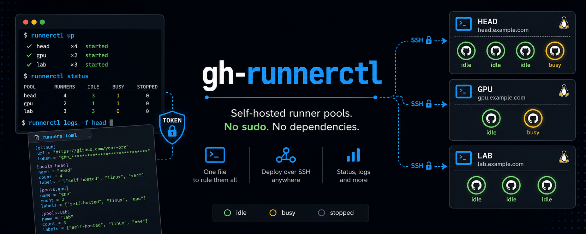

<div align="center">



**One Python file. Standard library only. Nothing to install on remote hosts.**

[](https://www.python.org/)
[](https://github.com/flinner/gh-runnerctl/blob/main/runnerctl)
[](LICENSE)
[](#install)
[](#limitations)
[](#why-another-one)

[Install](#install) ·
[Quick start](#quick-start) ·
[Configuration](#configuration) ·
[Commands](#commands) ·
[How it works](#how-it-works) ·
[Comparison](#comparison)

</div>

---

```console
$ runnerctl status

instance default   config=runners.toml   pools: head@machine1=4, gpu@gpunode=2
supervisor@machine1 running (pid 71324, detached)
supervisor@gpunode running (pid 4482, systemd)

  POOL       IDX  NAME              RUNNER   GITHUB   JOB
  head       1    machine1-head-1  running  online   idle
  head       2    machine1-head-2  running  online   busy
  head       3    machine1-head-3  running  online   idle
  head       4    machine1-head-4  running  online   idle
  gpu        1    gpunode-gpu-1     running  online   idle
  gpu        2    gpunode-gpu-2     stopped  online   -
```

**The config file is the interface.** Declare any number of pools in one
`runners.toml`; edit it, then:

- `runnerctl up` — full converge: download the runner release, register
  missing runners, prune surplus ones, start/reload every supervisor.
- `runnerctl reload` — soft apply: running supervisors re-read the file and
  start/stop runner processes accordingly. No GitHub calls.

Every mutating command takes `--dry-run` / `-n` and prints the plan instead:

```console
$ runnerctl up -n
plan for instance default (runners.toml):
  + register runner gpu/2 on gpunode as gpunode-gpu-2
  - deregister and delete runner head/5 on machine1 (machine1-head-5, idle)
  * reload supervisor on machine1 (SIGHUP pid 71324)
:: dry run — nothing changed
```

## Why another one?

Every existing multi-runner tool assumes root, Docker, or Kubernetes.
`runnerctl` targets the machines where you have none of those — HPC login
nodes, shared lab workstations, locked-down VMs:

| | |
|---|---|
| **No sudo, ever** | User-level systemd (with automatic session linger), or a detached supervisor where the user bus is disabled. Root is never required, for anything. |
| **No dependencies** | One file, Python 3.6+ stdlib. Remote hosts need only passwordless ssh — `up` deploys the script itself. |
| **Token never travels** | GitHub auth and all API calls stay on the control machine. Remote hosts receive only short-lived (~1 h, single-purpose) registration/removal tokens, piped over ssh **stdin** — never argv, never a file, never the PAT. |
| **No PAT required** | Works best with `GITHUB_TOKEN` or a logged-in `gh` CLI, but degrades to an interactive paste-a-token flow. |
| **Crash-safe** | One supervisor per machine owns every runner as a direct child and restarts each independently with exponential backoff. |

## Install

```bash
curl -fLo ~/.local/bin/runnerctl https://raw.githubusercontent.com/flinner/gh-runnerctl/main/runnerctl
chmod +x ~/.local/bin/runnerctl
curl -fLo runners.toml https://raw.githubusercontent.com/flinner/gh-runnerctl/main/runners.toml.example
```

Updating is never automatic: `runnerctl check-update` tells you when a newer
version exists (and prints the command), `runnerctl update` installs it in
place. `status` offers to run the check for you — configurable with
`check_updates = "ask" | "always" | "never"` in the config.

## Quick start

```bash
runnerctl init                 # or start from runners.toml.example
$EDITOR runners.toml           # set url (org or repo) and count
runnerctl up                   # converge: download, register, supervise
runnerctl status               # see the pool
```

Registering at the **org level** (`url = "https://github.com/my-org"`) is
recommended: one pool serves every repo in the org and GitHub load-balances
queued jobs across the runners automatically.

## Configuration

`runnerctl` looks for `runners.toml` in the current directory, then
`~/.config/runnerctl/runners.toml` (override with `-c FILE` or
`$RUNNERCTL_CONFIG`).

```toml
name = "default"          # instance name

[defaults]                # keys shared by every pool
url = "https://github.com/my-org"
base_dir = "~/gh-runners"
manager = "auto"          # per-machine supervisor hosting: auto | systemd | nohup

[pool.head]
host = "me@machine1.example.org"   # ssh destination (alias or user@host)
count = 4
labels = ["self-hosted", "linux", "x64"]

[pool.gpu]
host = "gpunode"
count = 2
labels = ["self-hosted", "linux", "x64", "gpu"]
```

A single anonymous `[pool]` (no named tables) is also valid — that's the pool
`default`, whose runner directories are `runner<N>` and whose GitHub-side
names are plain `<host>-<N>`.

| Key | Default | Meaning |
|---|---|---|
| `name` (top level) | `default` | Instance identity; names supervisor services and state |
| `config_version` (top level) | — | Schema version (`"1.0"`): major mismatch is refused, minor mismatch warns |
| `check_updates` (top level) | `ask` | After `status`: `ask` \| `always` \| `never` — checks only, never installs |
| `url` | — | Org URL (`https://github.com/my-org`) or repo URL (`.../owner/repo`) |
| `count` | `2` | Desired runners in the pool; `up` converges both directions |
| `labels` | `["self-hosted"]` | Runner labels |
| `base_dir` | `~/gh-runners` | Runners live in `<base_dir>/<dir_prefix><N>` |
| `version` | `latest` | Runner release to install, e.g. `"2.335.1"` |
| `name_prefix` | host / hostname | GitHub-side names `<prefix>-<pool>-<N>` |
| `group` | — | Runner group (org-level registration only) |
| `dir_prefix` | pool name | Directory naming; see [Adopting an existing setup](#adopting-an-existing-setup) |
| `host` | — | ssh destination to run this pool on; empty = this machine |
| `manager` | `auto` | How that machine's supervisor is hosted (pools on one machine must agree) |

Pool keys go in `[defaults]` (shared) or per `[pool.<name>]` (override).
Pools may share a `base_dir` (distinct `dir_prefix` enforced) or use separate
ones — even different orgs/repos per pool.

## Commands

Runners are addressed as `<pool>/<idx>` (`gpu/2`), a pool name (`gpu` = all
of it), or a bare index in single-pool files.

| Command | Does |
|---|---|
| `init` | Write a starter `runners.toml` |
| `up [--force] [-n]` | Converge every pool to the config (provision, register, supervise, prune) |
| `reload` | Supervisors re-read the config and apply it; no GitHub work |
| `status` / `ps` | Pool table: supervisors + runner processes + GitHub online/busy |
| `watch [-i SEC]` | Live-refreshing status (default every 10 s) |
| `down [--force] [-n]` | Stop all supervisors and runners, keep registrations |
| `rm <ref...> \| --all [--force] [-n]` | Deregister and delete runners |
| `start` / `stop` / `restart <ref...>` | Per-runner control (stopped runners stay registered, not respawned) |
| `logs [ref] [-f]`, `logs --daemon` | Runner logs / supervisor log (follows over ssh too) |
| `config` | Print the resolved configuration |
| `daemon` | Run the supervisor in the foreground (started for you by `up`) |
| `check-update` / `update` | Check for / install a newer runnerctl — never automatic |

Anything that would kill a running job (`stop`, `rm`, pruning in `up`,
`down`) checks the runner's busy state on GitHub first and skips busy runners
unless `--force`.

## How it works

```
 control machine                      ssh                     worker machines
┌──────────────────────────┐   ─────────────────►   ┌───────────────────────────┐
│ runnerctl (CLI)          │                        │ runnerctl (same file,     │
│  · GitHub auth + API     │   deploy: tar over     │   deployed by `up`)       │
│  · mint 1h reg tokens    │   ssh stdin            │  --as-host: "you are      │
│  · busy checks, status   │                        │   this machine"           │
│  · plans + decisions     │   invoke: runnerctl    │                           │
│                          │   --as-host <me> <cmd> │ runnerctl daemon          │
│ GITHUB_TOKEN stays here  │                        │  · owns run.sh children   │
│                          │   tokens: stdin only   │  · restart w/ backoff     │
│                          │                        │  · SIGHUP = re-read toml  │
│                          │   state: one JSON      │  · zero credentials       │
│                          │   probe per host       │                           │
└──────────────────────────┘                        └───────────────────────────┘
```

**One supervisor per machine.** `runnerctl daemon` owns every local runner's
`run.sh` as a direct child: it respawns a crashed runner with exponential
backoff (without disturbing its siblings), re-reads the config file on
`SIGHUP` (sent by `up`/`reload`/`start`/`stop`), and shuts every runner down
cleanly on `SIGTERM`. With a systemd user bus, `up` installs one user unit
(`runnerctl-<name>-<machine>.service`, `Restart=always`, `ExecReload` = HUP)
and enables session linger — the pool survives logout and reboot with no
root at any step. Where the user bus is disabled (typical HPC login nodes),
the same supervisor runs as a detached process: per-runner crash restarts
still work; only the supervisor itself isn't resurrected after reboot
(re-run `runnerctl up`).

**Remote execution is runnerctl driving itself.** There is no agent
protocol, no server, no remote install step. For a pool with `host = ...`,
the CLI tars **its own script plus your `runners.toml` verbatim** and pipes
that through `ssh host 'tar -x'`; every command then re-pushes the config
(remotes are never stale) and invokes the remote copy with `--as-host`,
which means: *keep only the pools assigned to you, treat them as local*.
The config is never rewritten or split per host — one file is the single
source of truth everywhere, filtered at load time.

**Tokens flow one way, downhill, and expire.** Registration and removal need
GitHub-side authority, so the control machine mints the short-lived
(~1 h, single-purpose) token via its own credentials and pipes it to the
remote command as **stdin** (`--tokens-stdin`) — it never appears in `ps`
output on a shared host, never lands on remote disk, and the PAT itself
never leaves the control machine. The remote supervisor holds no credentials
at all: registration happens in the short-lived CLI invocation, supervision
needs none.

**`status` is a two-source join.** The GitHub half (online/offline,
busy/idle) comes from the local API token, one query per distinct org/repo
scope. The process half comes from one `agent-status` probe per host — a
single JSON line with supervisor pid and per-runner process state. The two
halves join on the deterministic runner name (`<prefix>-<pool>-<N>`). An
unreachable host degrades to marked rows; a missing token degrades to
process-only columns. Status never mutates anything.

**Shared home directories** (typical clusters) are first-class: supervisor
state (`~/.local/state/runnerctl/<name>/<machine>/`) and systemd units
(per-machine names, guarded by `ConditionHost=`) are scoped per machine, so
hosts never fight over pidfiles or start each other's supervisors at boot.
Keep `dir_prefix` distinct between pools — the default (the pool name)
already is.

## Authentication

Four rungs, tried in order:

1. **Pre-supplied tokens** — piped over ssh stdin by a control machine
   (you never use this directly).
2. **`GITHUB_TOKEN`** / **`GH_TOKEN`** environment variable.
   Fine-grained PAT permissions: repo-level `administration:write`, or org-level
   `organization_self_hosted_runners:write`. Classic PAT: `repo`, or `admin:org`.
3. **`gh` CLI** — if you're logged in (`gh auth login`), its token is used.
4. **Interactive** — no token at all: `runnerctl` prints the exact GitHub
   settings-page URL, you paste the registration/removal token it shows, and
   the tool loops with a fresh prompt if a token is expired or spent.

Registration tokens minted via the API are cached and reused across a whole
`up`/`rm` pass (they live ~1 h) instead of one API call per runner.

## Adopting an existing setup

Already have hand-configured runners in `~/actions-runner/actions1..4`? Use a
single anonymous `[pool]` with:

```toml
[pool]
url = "https://github.com/my-org"
count = 4
base_dir = "~/actions-runner"
dir_prefix = "actions"
```

`runnerctl up` recognizes registered runners by their `.runner` file, keeps
their existing GitHub-side names, and simply takes over supervision. Stop any
tmux/nohup copies first — two listeners on one registration conflict.

## Comparison

| | root/sudo | deps | multi-host | declarative converge | GitHub-side status | no-token fallback |
|---|---|---|---|---|---|---|
| **gh-runnerctl** | no | none | ssh | yes (`up`/`reload` from config) | yes | yes |
| [vbem/multi-runners](https://github.com/vbem/multi-runners) | required (sudoers, user-per-runner) | bash+jq | no | no (imperative add/del) | no (`status` unimplemented) | no |
| [gershnik/multi-gh-action-runner](https://github.com/gershnik/multi-gh-action-runner) | sudo to install daemon | Python+PyGithub | no | config edit + restart; one crash stops the whole pool | no | no |
| [ARC](https://github.com/actions/actions-runner-controller) / [GARM](https://github.com/cloudbase/garm) / docker images | k8s / daemon / docker | heavy | k8s / providers | yes (autoscale) | yes | no |

If you have Kubernetes or Docker and want autoscaling, use
[actions-runner-controller](https://github.com/actions/actions-runner-controller)
or [GARM](https://github.com/cloudbase/garm) — this tool is deliberately the
small option for fixed machines.

## Limitations

- Linux only (macOS could work with `manager = "nohup"`; untested).
- Fixed-size pools — no webhook-driven autoscaling by design.
- No ephemeral (`--ephemeral`) mode yet.
- github.com only (no GHES) for now.
- Remote pools assume passwordless ssh (`BatchMode`); use one destination
  string per host consistently — it names the machine's state.

## License

[MIT](LICENSE)
